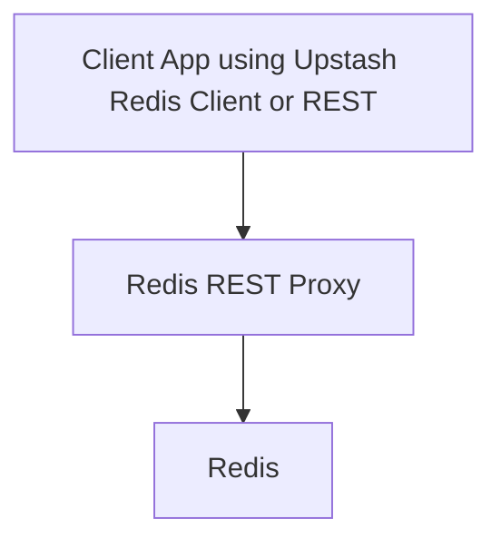

# Redis REST Proxy

[](https://github.com/nielspeter/redis-rest-proxy)
[](https://github.com/nielspeter/redis-rest-proxy/pkgs/container/redis-rest-proxy)

Redis REST Proxy exposes Redis functionality via a RESTful HTTP API. Ideal for client running in a serverless or edge environments where TCP/IP may not be available.

## Features

- **RESTful Interface:** Converts HTTP requests into Redis commands.
- **Serverless Friendly:** Connects applications running in serverless environments to Redis.
- **High Performance:** Built with Bun for fast and efficient operation.
- **Upstash Redis client** compatible.

## Compatibility Notice

This proxy is tested with the [Upstash Redis JavaScript Client](https://github.com/upstash/redis-js/tree/main) and aims to maintain basic compatibility with Upstash Redis services..... However:

```diff
+ Supported
- Pipeline & multi-exec transactions
- Base64 encoding/decoding
- Basic Redis commands
- Authentication via bearer token

! Not Supported
- Upstash-specific extensions
```

---

## Quick Start

### Docker

```bash
docker pull ghcr.io/nielspeter/redis-rest-proxy:latest
docker run -p 3000:3000 \
  -e AUTH_TOKEN="your-secret" \
  -e REDIS_HOST="your.redis.host" \
  ghcr.io/nielspeter/redis-rest-proxy
```

### Manual Installation

```bash
git clone https://github.com/nielspeter/redis-rest-proxy.git
cd redis-rest-proxy
bun install
bun run server.ts
```

---

## Configuration

Add these environment variables for Upstash compatibility:

```ini
# Required for Upstash-like clients
AUTH_TOKEN="your-replication-token"
REDIS_HOST="your.upstash.endpoint"
REDIS_PASSWORD="your-password"
```

---

## Upstash Client Usage

```typescript
import { Redis } from '@upstash/redis';

const redis = new Redis({
  url: 'http://your-proxy:3000',
  token: 'YOUR_AUTH_TOKEN',
});

// Works like Upstash Redis!
await redis.set('key', 'value');
const result = await redis.get('key');
```

---

## Deployment Architecture



---

## Contributing & Compatibility

We actively work to improve Upstash compatibility. To report issues:

1. Test with [Upstash Redis JS Client](https://github.com/upstash/redis-js)
2. Open issue with `[Upstash]` prefix
3. Include reproduction steps and proxy version

---

[Report Issue](https://github.com/nielspeter/redis-rest-proxy/issues)

```
ompatibility
```
